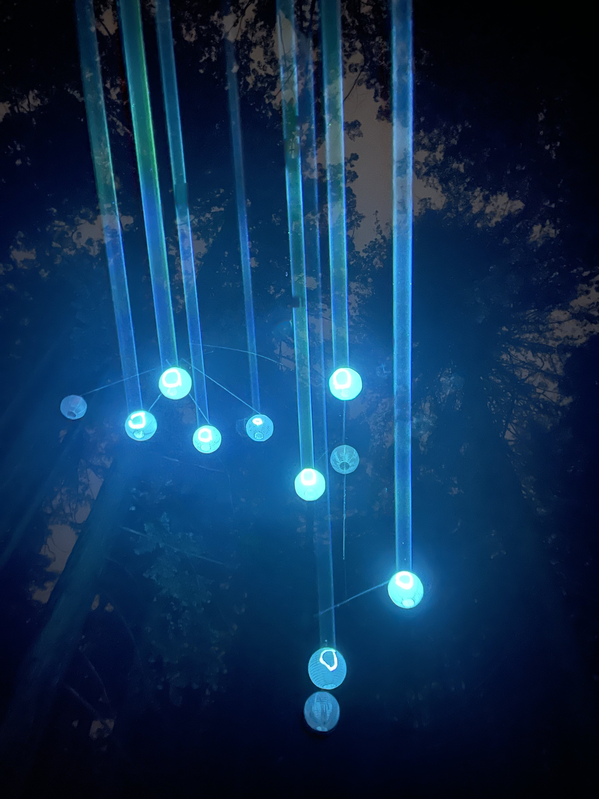
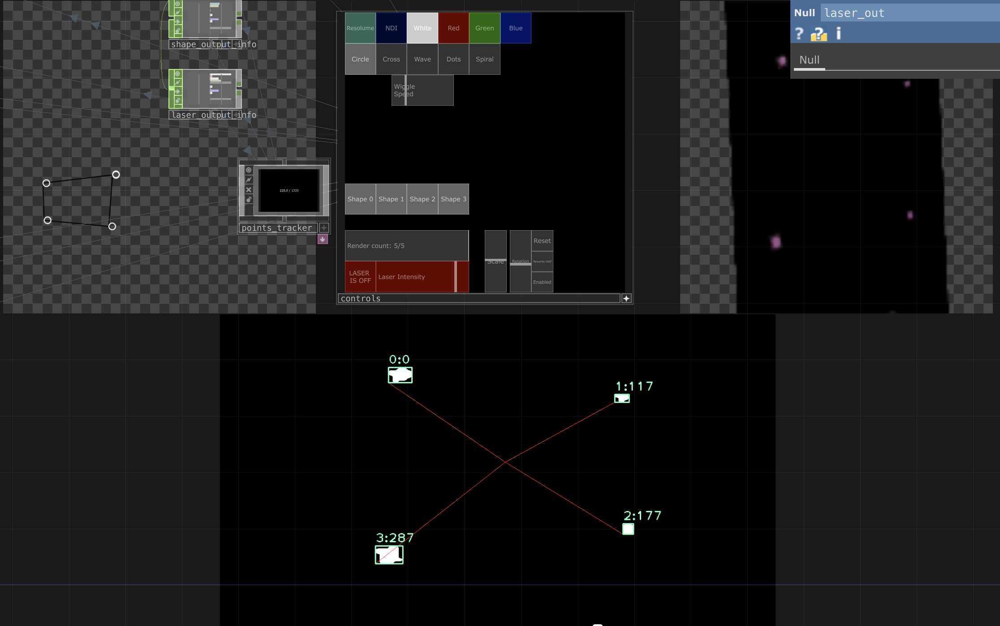
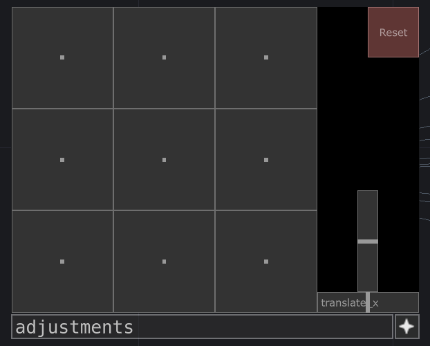
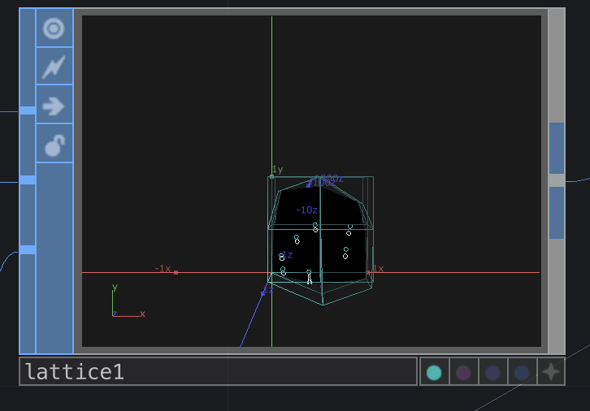
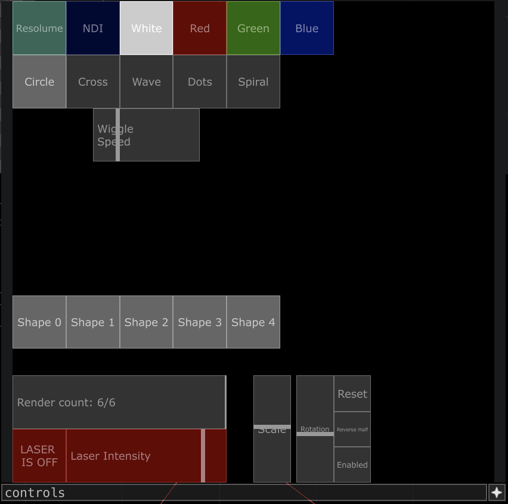

# Ēostre Spirits

A realtime paper lantern mobile tracing laser.

A TouchDesigner patch enabling an ILDA-based stage laser to track, in real time, the position of objects in free space

## The Setup

The project consists of the following parts:

- Paper lanterns containing infrared LEDs
- An ILDA stage laser (or any laser DAC with a TouchDesigner-compatible interface)
- A USB webcam, mounted on the laser, with an IR filter on the lens to capture only the light diffused inside the lanterns
- This TouchDesigner patch

### TouchDesigner

The patch works in these stages:

1. **Input**: Switchable between a sample video and a webcam.
2. **Processing**: After some pre-processing to emphasize interesting regions, runs the image through python script that uses OpenCV to track blobs with stable IDs
3. **Perspective/lens correction**: Using a 3x3 grid, warp the points to correct for lens distortion and the laser spread so that the beam hits the lanterns in actual space
4. **Vectorization**: Place interesting shapes on the points
5. **LASER BEAMS**: SHOOT LASERS!!!!!

The core components are:

#### blob_tracker

Does some pre-processing to create distinct blobs, then runs the core python script. The script identifies the individual blobs and assigns them IDs. It tries to keep the IDs stable as the blobs rotate throughout the frame, but doesn't do a perfect job.

#### grid_warper

Ultimately, the laser needs to hit the lanterns. No matter how carefully we align the camera on top the laser, there'll still need to be corrections to account for things like the warping of the lens and the way the laser galvos move in physical space.

 

This OP provides a 3x3 grid of points that can be adjusted to connect our ideal digital calculations into the messy real world. In the field, you can adjust your camera positioning to get the alignment roughly correct, and then use this grid warping to get the lasers to land exactly on the lanterns.

#### Control panel

- Top row: **Color source**. Can be set to flat white/red/green/blue for simple deployments, or you can select Resolume (Syphon) or NDI to map the output of a VJ tool like Resolume Arena or Synesthesia 
- Second row: **Shape**. Which shape to draw on each detected blob.
- "**Wiggle speed**": For the "wave" shape, how fast should it wiggle?
- **Shape selector**: Depending on your laser specs, the galvos might have trouble keeping up with drawing too many points. See [#Rendering performance](Rendering performance) below for more details
- **Laser controls**: Arm the laser, set its intensity.
- ** Scale / Rotation controls**: Adjust the size of the shapes, and their rotation speed. Fun with the spiral!

## Rendering performance

Sometimes, the set of vectors that you want to draw ends up being too much for your laser hardware, resulting in distorted shapes, flickering, or missing portions of your image. This patch provides several options for tuning the rendering performance so you can get a stable image.

1. *Laser device properties*: The `laser` and `laserdevice1` OPs. These are built-in OPs which have a wealth of tuning parameters. Consult TouchDesigner's [Laser CHOP documentation](https://docs.derivative.ca/Laser_CHOP) for details on tuning.
2. *Shape selection*: Additionally, the "Render count" and "Shape #" buttons in the main patch controls can be used. The "Render count" and "Shape #" buttons both accomplish the same thing, excluding shapes from the final output to the laser. The slider lets you just arbitrarily remove shapes from "the end" of the list, and the buttons let you choose which shapes to exclude.

Depending on your laser, it can take some fiddling to get a stable image. Refer to your laser's spec sheet and any numbers that might be exposed from your laser manufacturer's suggested control software for a good starting point.
